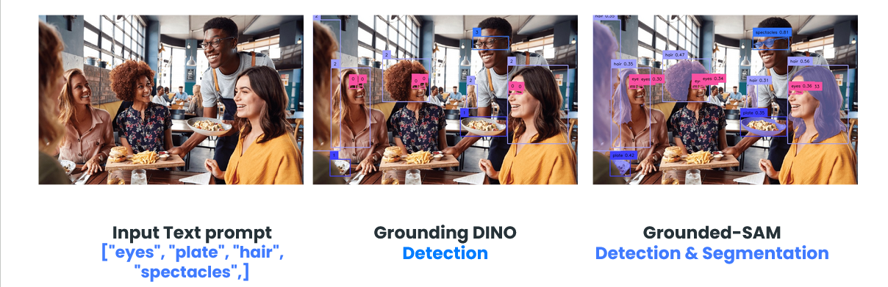
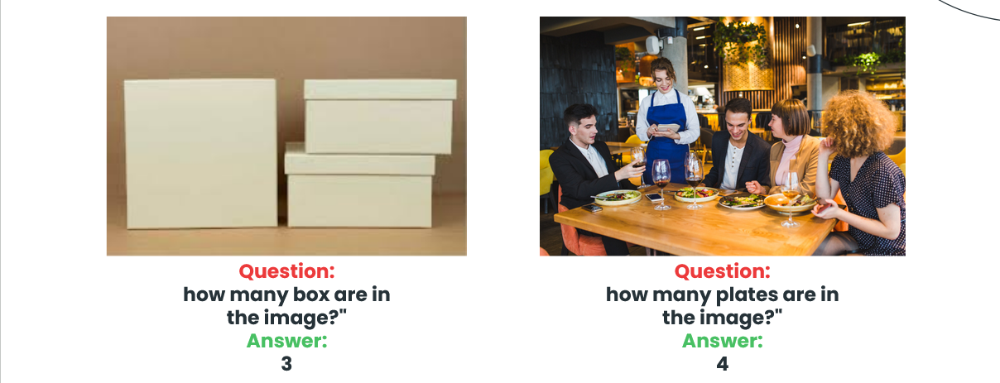

# Application of Vision Language Models with ROS 2 workshop

We explore how robots can perceive and understand their environment through the powerful combination of image understanding and natural language processing. This repository dives deep into the fascinating world of **vision-language models** for **robotics applications**, specifically utilizing the powerful **Intel OpenVINO Toolkit**.

This repository is presented as a **workshop** at the **ROS meetup Lagos**

## Prerequisites
- **Ubuntu 22.04 or newer**
- **ROS 2 Humble or newer**
- **Python 3**
- **Intel OpenVINO toolkit**

## Hardware Requirements
Please note that to run the code in this repository, you will need a device compatible with the **[Intel OpenVINO Toolkit](https://docs.openvino.ai/2024/home.html)**. This typically includes **Intel CPUs**, Intel Neural Compute Sticks, or other Intel hardware supporting OpenVINO.

### Create a ROS 2 colcon workspace

```
mkdir -p ~/ros2_ws/src
```

### Create & Setup Python Virtual Environment 
```
cd ~/ros2_ws

virtualenv -p python3 ./vlm-venv                      
source ./vlm-venv/bin/activate

# Make sure that colcon doesn’t try to build the venv
touch ./vlm-venv/COLCON_IGNORE        
```

### Install Python dependencies
```
pip install timm --extra-index-url https://download.pytorch.org/whl/cpu  # is needed for torch

pip install "openvino>=2024.1" "torch>=2.1" opencv-python supervision transformers yapf pycocotools addict "gradio>=4.19" tqdm
```

### Add your Python virtual environment package path 
**Make sure to update <<YOUR_USER_NAME>> with your system username.**
```
export PYTHONPATH='/home/<<YOUR_USER_NAME>>/ros2_ws/vlm-venv/lib/python3.10/site-packages'
```

### Clone this repository inside the 'src' folder of your workspace
```
cd ~/ros2_ws/src

git clone https://github.com/nilutpolkashyap/vlms_with_ros2_workshop.git
```

### Download weights and required packages
```
cd ~/ros2_ws/src/vlms_with_ros2_workshop

python3 download_weights.py
```

### Download OpenVINO IR models from Google Drive

Download the zip file from here [link here](https://drive.google.com/file/d/1bwEZ_kK3ePcYiRJPcbzWz4CRnf1U9hH8/view?usp=sharing)

Place the contents of the zip file inside the **'openvino_irs'** directory in the following path

```
~/ros2_ws/src/vlms_with_ros2_workshop/ros2_vlm/ros2_vlm/modules/openvino_irs
```

### Build and source the workspace 
```
cd ~/ros2_ws
colcon build --symlink-install

source ~/ros2_ws/install/setup.bash
```

## Object detection and masking with GroundedSAM (GroundingDINO + SAM)

**GroundedSAM** tackles **object detection** and **segmentation**. It integrates various open-world models, allowing to not just detect objects but also **understand** their specific regions. This can empower robots to act on specific parts (e.g., grasping a cup's handle) based on textual instructions or visual cues.

<div align="center">
</div><br />

### Run the GroundedSAM node
```
ros2 run ros2_vlm grounded_sam --ros-args -p device:='CPU' -p video_source:=/dev/video2 -p isSegment:=False -p detectionList:="["eyes", "person", "hair"]"
```
### **ROS 2 CLI Arguments**
- device - Inference Device (e.g. CPU, GPU, NPU)
- video_source - Video source to get the image frame
- isSegment - To run Segment Anything model (True/False)
- detectionList - List of objects to detect

Check out more in the [GroundedSAM OpenVINO Notebook](https://github.com/openvinotoolkit/openvino_notebooks/blob/latest/notebooks/grounded-segment-anything/grounded-segment-anything.ipynb)

## Visual Question Answering using BLIP 

**BLIP** bridges the gap between vision and language. It analyzes images and extracts meaningful information, generating captions describing the scene or answering questions about it. This lets robots not only **"see"** their environment but also **understand** its context and **respond** to natural language instructions effectively.

<div align="center">
</div><br />

### Run the Blip Visual QnA node
```
ros2 run ros2_vlm blip_visual_qna --ros-args -p device_name:="GPU.0" -p question:="What is in the image?" -p image_path:="/home/nilutpol/ai_ws/src/blip_qna_code/demo2.jpg"
```
### **ROS 2 CLI Arguments**
- device_name - Inference Device (e.g. CPU, GPU, NPU)
- question - Question for the blip model
- image_path - Path to the image source

Check out more in the [BLIP Visual Question Answering OpenVINO Notebook](https://github.com/openvinotoolkit/openvino_notebooks/blob/latest/notebooks/blip-visual-language-processing/blip-visual-language-processing.ipynb)

## Resources
- [Using Python Packages with ROS 2](https://docs.ros.org/en/humble/How-To-Guides/Using-Python-Packages.html)
- [How to use (python) virtual environments with ROS2?
](https://answers.ros.org/question/371083/how-to-use-python-virtual-environments-with-ros2/)
- [Intel OpenVINO Toolkit](https://docs.openvino.ai/2024/home.html)
- [OpenVINO Notebooks](https://github.com/openvinotoolkit/openvino_notebooks)
